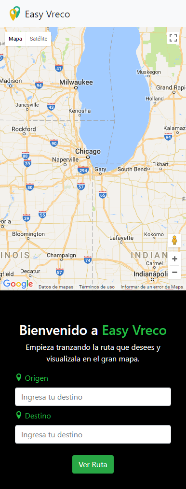
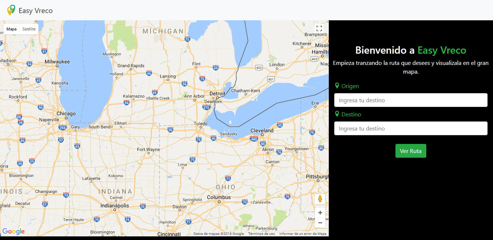

# INSTA COLLAGE

### Challenge Geolocation
#### Objetivo:
Crear una página web usando la API Geolocation de HTML5 y Google Maps API.
La pagina web nos permitirá trazar una ruta en nuestro mapa a partir de los puntos de origin y destino que el usuario desee. Además también cuenta con un autocompletado lo que facilita la búsqueda de algún lugar.

  

#### Herramientas:
- Bootstrap 4
- CSS3
- HTML5
- API Geolocation
- API Google Maps
- JS ES6
- Jquery

#### Sobre el futuro del producto:
- Se planea añadir un marcador diferente para los puntos del mapa.

#### Desarrolladoras:
- Daniela Gonzales  
- Elizabeth Segura
